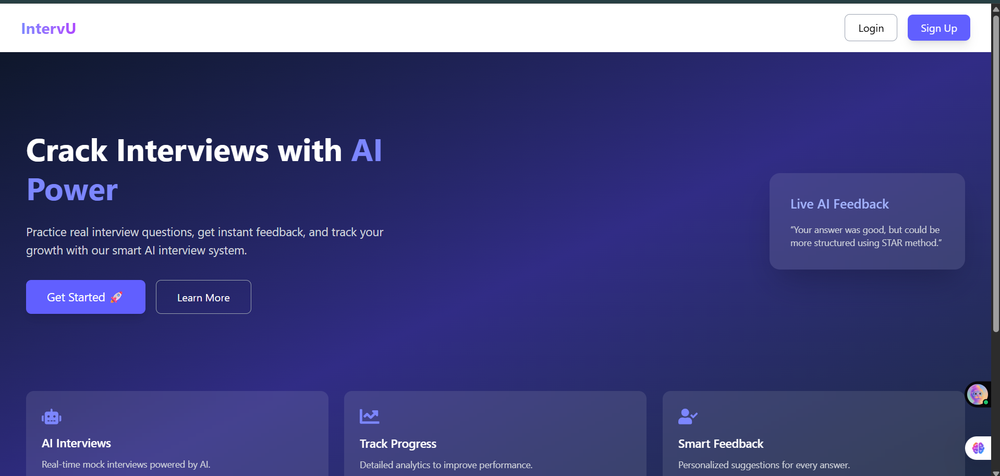
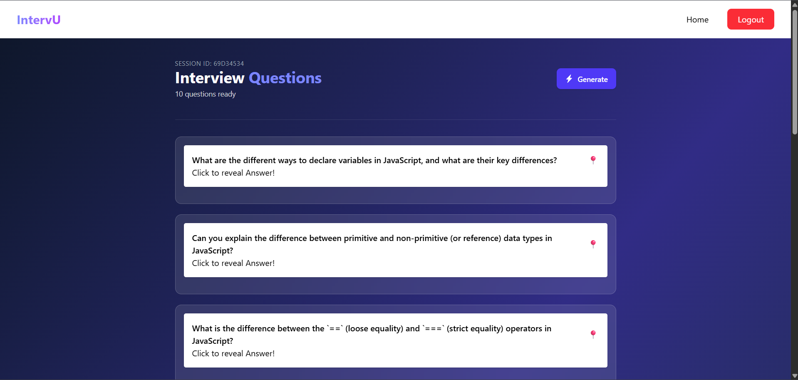
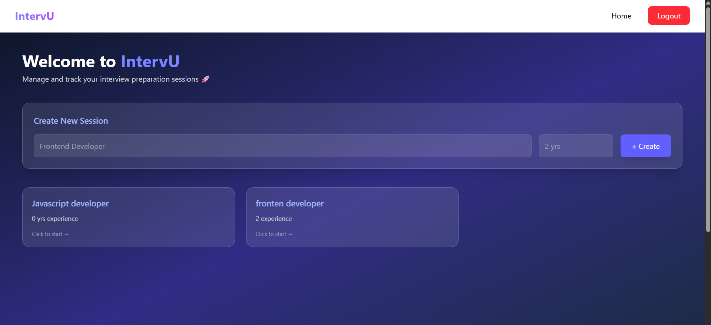

# 🚀 IntervU – AI Interview Preparation App

**IntervU** is an AI-powered web application designed to help users prepare for interviews through dynamic question generation and personalized practice sessions.

---

## ✨ Features

- 🤖 AI-generated interview questions using **Gemini**
- 📊 Personalized practice sessions
- 🔄 Real-time feedback (extendable)
- 💾 User data storage and history tracking
- ⚡ Fast and responsive UI

---

## 🛠️ Tech Stack

- **Frontend:** React
- **Backend:** Express.js, Node.js
- **Database:** MongoDB with Mongoose
- **AI Integration:** Gemini API

---

## 🧠 Concepts Used

- RESTful API design
- CRUD operations
- State management (React Hooks)
- Async/Await & API handling
- MVC architecture (optional if you followed it)
- AI Prompt Engineering

---

## 📸 Screenshots

### 🏠 Landing Page



### 🎯 Interview Page



### 📊 Dashboard



---

## ⚙️ Installation & Setup

```bash
# Clone the repository
git clone https://github.com/your-username/intervu.git

# Navigate to project
cd intervu

# Install backend dependencies
cd backend
npm install

# Install frontend dependencies
cd ../frontend
npm install
```

---

## ▶️ Run the App

```bash
# Run backend
cd backend
npm run dev

# Run frontend
cd frontend
npm start
```

---

## 🔑 Environment Variables

Create a `.env` file in backend:

```
MONGO_URI=your_mongodb_connection
GEMINI_API_KEY=your_api_key
```

---

## 🚀 Future Improvements

- 🎤 Voice-based interview simulation
- 📈 Performance analytics dashboard
- 🧑‍💼 Role-specific interview tracks
- 🌐 Deployment (AWS/Vercel)

---

## 🤝 Contributing

Pull requests are welcome. For major changes, please open an issue first.

---

## 📌 Author

**Shalini Singh**

---
